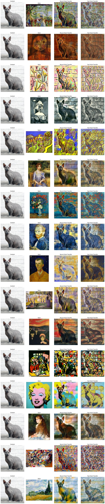

# Neural Style Transfer exploration
This project implements a traditional Neural Style Transfer model using AWS Sagemaker, to generate high-quality stylized images with better visual quality than those produced by Fast Style Transfer models.

## Problem statement
Fast Style Transfer models can generate stylized images in real-time or near real-time, but often at the expense of image quality. This project aims to produce higher quality stylized images using a traditional Neural Style Transfer model that takes a content image and a style image and produces a new image by transferring the style onto the content image.

## Methodology
We explore different implementations of Neural Style Transfer models in two popular deep learning frameworks: Tensorflow and Pytorch. We fine-tune and examine different parameters for each implementation and select the best model based on the resulting stylized images.

At the end of the exploration phase, we implement the refined model using AWS Sagemaker estimators, leveraging the power of cloud computing to generate high-quality stylized images efficiently, using a selected sequence of style images. Finally, we compare the generated images using Neural Style Transfer with images produced by using Fast Style Transfer using appropriate metrics.

## Results
The results show a large improvement in the Structural Similarity Index (SSIM) compared to Fast Style Transfer models.This means that the images generated by Neural Style Transfer better preserve the original content of the image.

## Conclusion
This project demonstrates that traditional Neural Style Transfer models can generate high-quality stylized images with better visual quality than Fast Style Transfer models. The methodology used in this project can be applied to other deep learning tasks, and the AWS Sagemaker implementation allows for efficient and scalable model training and deployment.

